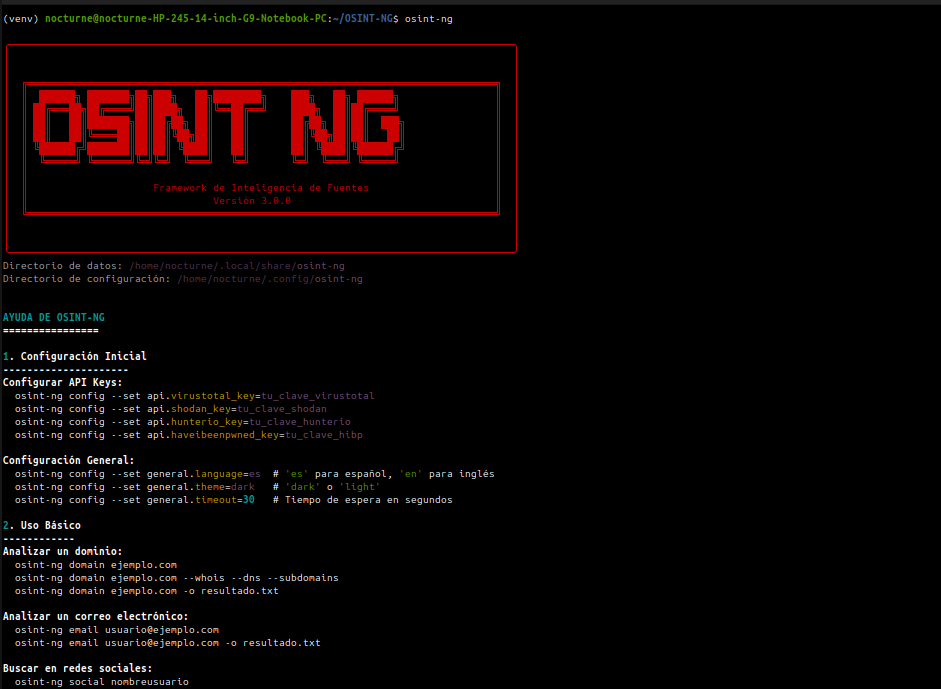

# OSINT-NG Framework



**OSINT-NG** es un framework profesional de Inteligencia de Fuentes Abiertas (OSINT) diseñado para profesionales de la ciberseguridad, investigadores y equipos de seguridad. Proporciona herramientas poderosas para recopilar y analizar información de fuentes abiertas de manera eficiente.

## Características Principales

- Interfaz de línea de comandos intuitiva con salida formateada
- Módulos independientes para diferentes tipos de búsquedas OSINT
- Almacenamiento estructurado en base de datos SQLite
- Sistema de caché para optimizar consultas repetidas
- Soporte para múltiples APIs de servicios de seguridad
- Arquitectura modular para fácil expansión
- Generación de informes en múltiples formatos

## Requisitos del Sistema

- Python 3.8 o superior
- pip (gestor de paquetes de Python)
- Conexión a Internet para consultas en línea

## Instalación

### Opción 1: Instalación global (Recomendada para uso frecuente)

1. Clona el repositorio y accede al directorio:
   ```bash
   git clone https://github.com/nocturne-cybersecurity/OSINT-NG.git
   cd OSINT-NG
   ```

2. Otorga permisos de ejecución al script:
   ```bash
   chmod +x osint-ng.py
   ```

3. Crea un enlace simbólico en /usr/local/bin/ (requiere permisos de superusuario):
   ```bash
   sudo ln -s $(pwd)/osint-ng.py /usr/local/bin/osint-ng
   ```

4. Instala las dependencias del sistema (puedes hacerlo en un entorno virtual si lo prefieres):
   ```bash
   pip install -r requirements.txt
   ```

### Opción 2: Instalación con entorno virtual (Recomendada para desarrollo)

1. Clona el repositorio:
   ```bash
   git clone https://nocturne-cybersecurity/OSINT-NG.git
   cd OSINT-NG
   ```

2. Crea y activa un entorno virtual:
   ```bash
   python -m venv venv
   source venv/bin/activate  # En Linux/Mac
   # O en Windows: .\venv\Scripts\activate
   ```

3. Instala las dependencias:
   ```bash
   pip install -r requirements.txt
   ```

4. Para ejecutar el script, usa:
   ```bash
   osint-ng
   ```

## Configuración de API Keys

Para aprovechar todas las funciones de OSINT-NG, necesitarás configurar las siguientes claves de API en el archivo de configuración ubicado en `~/.config/osint-ng/api_keys.json`:

```json
{
    "virustotal": "tu_clave_virustotal",
    "shodan": "tu_clave_shodan",
    "hunterio": "tu_clave_hunterio",
    "haveibeenpwned": "tu_clave_hibp"
}
```

### Cómo obtener las claves de API:

- **VirusTotal**: Regístrate en [VirusTotal](https://www.virustotal.com/)
- **Shodan**: Obtén una clave en [Shodan](https://developer.shodan.io/)
- **Hunter.io**: Regístrate en [Hunter](https://hunter.io/)
- **Have I Been Pwned**: Obtén una clave en [HIBP](https://haveibeenpwned.com/API/Key)

## Uso

Una vez instalado, puedes usar OSINT-NG directamente desde la línea de comandos con el comando `osint-ng`:

### Comandos disponibles:

```bash
# Mostrar ayuda general
osint-ng --help

# Mostrar todos los comandos disponibles
osint-ng --commands

# Analizar un dominio (WHOIS, DNS, subdominios)
osint-ng domain example.com

# Analizar una dirección de correo electrónico
osint-ng email usuario@example.com

# Buscar un nombre de usuario en redes sociales
osint-ng social username

# Listar todos los módulos disponibles
osint-ng list

# Mostrar estadísticas de búsquedas
osint-ng stats
```

### Opciones comunes:

```bash
# Especificar módulos específicos para ejecutar
osint-ng domain example.com --modules whois,dns

# Exportar resultados a un archivo
osint-ng domain example.com --output resultados.json
osint-ng domain example.com --output resultados.csv --format csv

# Mostrar información detallada
osint-ng domain example.com --verbose

# Especificar el número de hilos para operaciones paralelas
osint-ng domain example.com --threads 5
```

## Ejemplos de uso

### 1. Análisis completo de un dominio
```bash
osint-ng domain example.com
```

### 2. Búsqueda de subdominios con enumeración activa
```bash
osint-ng domain example.com --modules subdomains --active
```

### 3. Verificar una dirección de correo electrónico
```bash
osint-ng email contacto@example.com
```

### 4. Buscar un nombre de usuario en redes sociales
```bash
osint-ng social johndoe
```

## Módulos disponibles

### Dominio
- **whois**: Información de registro de dominios
- **dns**: Consulta de registros DNS (A, AAAA, MX, TXT, etc.)
- **subdomains**: Enumeración de subdominios

### Email
- **validation**: Validación de formato de correo electrónico
- **disposable**: Detección de correos desechables
- **breaches**: Búsqueda en filtraciones de datos (requiere API key de HIBP)
- **hunter**: Búsqueda de información relacionada (requiere API key de Hunter.io)

### Social
- **profiles**: Búsqueda de perfiles en redes sociales
- **reputation**: Análisis de reputación en línea

## Configuración avanzada

Puedes personalizar el comportamiento de OSINT-NG editando el archivo de configuración en `~/.config/osint-ng/config.ini`.

```ini
[general]
language = es
theme = dark
max_threads = 10
timeout = 30
user_agent = OSINT-NG/3.0.0

[modules]
whois_enabled = true
dns_enabled = true
subdomain_enabled = true
email_enabled = true
social_enabled = true
```

## Solución de problemas

### Error: Módulo no encontrado
Asegúrate de que todas las dependencias estén instaladas correctamente:
```bash
pip install -r requirements.txt
```

### Error de conexión
Verifica tu conexión a Internet y las configuraciones de proxy si es necesario.

## Contribución

Las contribuciones son bienvenidas. Por favor, lee nuestra guía de contribución antes de enviar un pull request.

## Licencia

Este proyecto está bajo la licencia MIT. Ver el archivo `LICENSE` para más detalles.

## Soporte

Si encuentras algún problema o tienes preguntas, por favor abre un issue en el repositorio.

---

Desarrollado por Rodrigo Lopez Pizarro incluye capacidades avanzadas de visualización de datos:

- Gráficos de relaciones entre entidades
- Mapas de redes sociales
- Líneas de tiempo de actividad
- Análisis de metadatos

## Uso Básico

### Ejecución Directa:
```bash
# Ejecutar desde el directorio del proyecto
osint-ng [comando] [opciones]

# Si creaste el enlace simbólico
osint-ng [comando] [opciones]
```

### Ejemplos de Uso:
```bash
# Ver ayuda
osint-ng --help

# Analizar un dominio
osint-ng domain ejemplo.com

# Analizar correo electrónico
osint-ng email usuario@ejemplo.com

# Buscar información de una persona
osint-ng person "Nombre Apellido"
```

### Opciones Globales:
```
-o, --output FILE   Guardar resultados en archivo
-v, --verbose       Mostrar información detallada
--version           Mostrar versión
--help              Mostrar ayuda
```

## 🛠️ Módulos Incluidos

- **WHOIS Lookup**: Consulta información de registro de dominios
- **Email Harvester**: Busca correos electrónicos asociados a dominios
- **Subdomain Enumerator**: Enumera subdominios de un dominio
- **Person Search**: Busca información de personas en fuentes abiertas
- **Network Scanner**: Escanea puertos y servicios en red
- **Social Media Lookup**: Busca perfiles en redes sociales

##  Visualización de Datos

OSINT-NG incluye capacidades avanzadas de visualización de datos:

- Gráficos de relaciones entre entidades
- Mapas de redes sociales
- Líneas de tiempo de actividad
- Análisis de metadatos

## 🔒 Seguridad y Privacidad

- Todas las conexiones usan HTTPS
- Soporte para proxies y TOR
- Opción de modo anónimo
- No se almacena información sensible sin consentimiento

##  Licencia

Este proyecto está bajo la licencia MIT. Ver el archivo [LICENSE](LICENSE) para más detalles.

##  Contribuciones

¡Las contribuciones son bienvenidas! Por favor, lee nuestras [guías de contribución](CONTRIBUTING.md) para más información.

##  Contacto

Para consultas o soporte, por favor abre un issue en el repositorio o contacta a [rodrigolopezpizarro271@gmail.com](mailto:rodrigolopezpizarro271@gmail.com).

---

<div align="center">
  Hecho por Rodrigo López | [@nocturne](rodrigolopezpizarro271@gmail.com)
</div>
